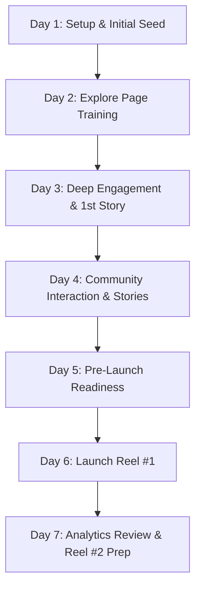

# Kivio — Instagram Growth & Site-Traffic Playbook

A complete step-by-step guide to warming up a fresh Instagram account, establishing algorithmic trust, publishing high-retention Reels, and converting viewers into active users on **[kivio.pro](https://kivio.pro)**.

> **A note on algorithm mechanics:** Exact view thresholds and follow quotas are widely observed best practices across creator communities rather than officially published Meta constants. However, the core principles—hooking viewers in 0–2 seconds, genuine community engagement, high retention, and keeping external URLs out of post captions—are proven fundamentals.

---

## 1. Niche & Positioning

* **Primary Niche:** AI Video Clipping / Short-Form Video Repurposing SaaS
* **Sub-Niches:**
  * Short-Form Video Production (Instagram Reels, TikTok, YouTube Shorts)
  * Podcasting & Streamer Tools (16:9 horizontal to 9:16 vertical reframe)
  * Creator Workflow & Editing Productivity Hacks
* **Core Value Proposition (kivio.pro):**
  Paste a YouTube link or upload a video file—**Kivio** automatically identifies the most engaging moments, detects active speakers, reframes to 9:16, and generates styled karaoke-animated captions ready for TikTok, Reels, and Shorts without manual keyframing.

---

## 2. Competitor & Authority Accounts to Follow

Following and interacting with these accounts signals your niche to Instagram's recommendation graph and helps place your content in front of your exact target users.

### Category A: Direct Competitors (AI Video & Clipping SaaS)
| Account | Handle | Core Focus / What to Study |
| :--- | :--- | :--- |
| **OpusClip** | `@opusclip` | Long-to-short AI clipping, viral hook scores, UI showcases |
| **Vizard AI** | `@vizard.ai` | Multi-speaker reframing demos, split-screen video showcases |
| **Submagic** | `@submagic.co` | Caption typography, dynamic sound effects, short-form editing |
| **Klap** | `@klap.app` | Minimal UI demos, speed-focused clip generation |
| **Captions AI** | `@captions.app` | Mobile AI video effects, dynamic typography trends |
| **Descript** | `@descript` | Podcast transcription, text-based editing workflows |
| **CapCut** | `@capcut` | Viral editing templates, trending audio and transitions |

### Category B: Creator Coaches & Editing Authorities
| Account | Handle | Why Engage in Comments |
| :--- | :--- | :--- |
| **Think Media** | `@thinkmediaofficial` | YouTube growth, podcast setups, video editing advice |
| **Colin & Samir** | `@colinandsamir` | Creator economy news and video business strategies |
| **Hillier Smith** | `@hillierasmith` | High-level editing breakdowns (MrBeast/Logan Paul editor) |
| **Hayls World** | `@haylsworld` | Tech reviews, productivity tools, and AI software |
| **Pat Flynn** | `@patflynn` | Podcasting strategies and automation workflows |

---

## 3. Profile Setup & Account Security (Day 1)

1. **Account Type:** Set to **Creator Account** (*Settings > Account type and tools > Switch to professional account > Creator*).
   * Category: **Video Creator** or **Software / Tech**.
2. **SEO Name Field:** `Kivio | AI Video Clips & Reels`
   *(Instagram indexes this in search. Do not leave your name alone without keywords).*
3. **Bio Copy:**
   ```text
   🎬 Turn long videos into viral short clips in minutes
   📋 Paste a YouTube link or upload — zero editing needed
   ✂️ Multi-speaker tracking + auto animated captions
   👇 Create your first clips free
   ```
4. **Link in Bio:** Use a UTM-tagged link to track conversions in your analytics:
   `https://kivio.pro/?utm_source=instagram&utm_medium=bio&utm_campaign=organic_reels`
5. **Account Security:** Enable **Two-Factor Authentication (2FA)** under *Settings > Accounts Center > Password and Security*.

---

## 4. The 7-Day Warm-Up Blueprint

> **CRITICAL RULE:** Do **NOT** post any Reels or feed posts during Days 1 to 5. Use the account purely as an active, genuine consumer in your niche.



---

### Day 1: Setup & Initial Follows
* **Duration:** 15–20 minutes.
* **Tasks:**
  1. Complete 100% of profile details (Bio, Profile Picture, 2FA, UTM link).
  2. Follow **5 accounts only**: `@opusclip`, `@vizard.ai`, `@submagic.co`, `@descript`, `@thinkmediaofficial`.
  3. Watch 5–10 of their Reels from start to finish without skipping.
  4. Like 2–3 posts.
  5. Close the app and let it rest.

### Day 2: Explore Page Training
* **Duration:** 15 minutes (split morning/evening).
* **Tasks:**
  1. Search `#videoeditinghacks` and `#podcastclips` in the search tab.
  2. Watch 6–8 Reels completely. Save 1–2 high-performing ones.
  3. Follow 3 more creator accounts: `@colinandsamir`, `@captions.app`, `@hillierasmith`.
  4. Leave **1 thoughtful comment** (5+ words) on a recent post (e.g., *"The subtitle word-by-word animation pacing on this is super clean"*).

### Day 3: Deep Engagement & 1st Story
* **Duration:** 15–20 minutes.
* **Tasks:**
  1. Check your **Explore Page**. Verify that it displays video editing and AI content.
  2. Watch 10 Reels from the explore feed. Like 4, save 1.
  3. Post **1 casual Story** (workspace photo, or a poll: *"What's the most tedious part of editing Reels? A) Speaker Framing B) Subtitles"*).
  4. Leave 2 thoughtful comments on competitor posts.

### Day 4: Story Engagement & Target Creators
* **Duration:** 15 minutes.
* **Tasks:**
  1. Watch and react to 3 Stories from accounts you follow.
  2. Follow 3–4 small-to-mid podcasters or streamers who post horizontal clips (your actual target users).
  3. Post 1 Story showing a sneak peek of Kivio's automatic reframing UI.

### Day 5: Pre-Launch Readiness
* **Duration:** 15 minutes.
* **Tasks:**
  1. Do your standard 5-minute warm-up scroll and like 2 posts.
  2. Export your **First Reel** file (12–18s duration, 1080×1920, high-contrast hook text).
  3. Draft your caption and copy the hashtag bundle.

### Day 6: Launching Reel #1
* **Pre-Posting (5 mins before):** Open Instagram, watch 3 Reels in your feed, like 1.
* **Posting Steps:**
  1. Upload video from camera roll.
  2. Add low-volume background audio (3–5%).
  3. Pick a clean cover frame with readable hook text.
  4. Caption CTA: *"Link in bio to try Kivio free"*.
  5. Hashtags: `#aivideotools #podcastclips #videoeditinghacks #shortformcontent #creatoreconomy`
* **Post-Buffer (10 mins after):**
  * **Do NOT close the app immediately.** Stay active for 5–10 minutes browsing feed or replying to any incoming comments.

### Day 7: Review & Routine
* Check 24-hour analytics (watch time, reach ratio, profile visits).
* Share the Reel to Stories with an interactive sticker ("Tap to watch").
* Prep Reel #2 for Day 8.

---

## 5. Why New Accounts Stall at ~145 Views & How to Break Out

When you post a new Reel, Instagram tests it on an **Initial Audience (100–150 viewers)** before expanding distribution:

```
[ New Reel Published ]
         │
         ▼
[ Small Initial Audience: ~100–150 viewers ]
         │
    ┌────┴──────────────────────────┐
    │                               │
[ Low early retention / quick skip ] [ High 3s retention + saves/shares ]
    │                               │
    ▼                               ▼
[ Reach stalls at ~150 views ]     [ 2nd Distribution Wave: 1k–5k+ views ]
```

### 4 Rules to Pass the Initial Test Window:
1. **Hook in 0–2 Seconds:** Bold, high-contrast on-screen text with immediate on-screen movement.
2. **Keep it Short (12–18s):** Maximizes completion and rewatch rate.
3. **No Outbound URLs in Captions:** Instagram deprioritizes captions with web links; always say *"Link in bio"*.
4. **Seamless Video Loop:** Match the final sentence to the opening hook to trigger continuous loops.

---

## 6. Account Safety & Anti-Flagging Rules

| Do ✅ | Avoid ❌ |
| :--- | :--- |
| Use consistent home Wi-Fi or cellular data | **VPNs / proxy IPs** (can trigger verification locks) |
| Follow accounts gradually across days | Mass-following 30+ accounts in one sitting |
| Write specific, human comments (5+ words) | Copy-pasted comments, bot text, or single emojis |
| Stay active in-app 5–10 min after posting | Posting and instantly closing the app |
| Use one primary physical mobile device | Logging in/out across multiple browser sessions |

---

## 7. Plug-and-Play Reel Scripts for Kivio

### Script 1: "Before vs After" (Core Pain Point)
* **Hook (0–2s):** *"Stop scrubbing through a 45-minute podcast looking for clips."*
* **Visual:** Frustrated editor manually keyframing in timeline software vs pasting a link into Kivio.
* **Body (2–10s):** *"Instead of hunting for timestamps and cropping by hand, paste your YouTube link into Kivio. It finds the top moments, reframes to 9:16, and syncs animated captions automatically."*
* **CTA (10–14s):** *"Try it on your next video — link in bio."*

### Script 2: Multi-Speaker Reframing (Technical Edge)
* **Hook (0–2s):** *"Why standard AI clippers ruin 3-person podcast clips..."*
* **Visual:** Standard single-crop cutting off co-hosts vs Kivio automatically switching to stacked split-screen.
* **Body (2–10s):** *"Most clipping tools force a single-person crop that cuts people out. Kivio detects 3+ speakers and switches to a stacked letterbox layout so everyone stays on screen."*
* **CTA (10–14s):** *"Generate your first clip free at kivio.pro (link in bio)."*

### Script 3: Speed Comparison
* **Hook (0–2s):** *"One long video, five viral short clips, under 60 seconds."*
* **Visual:** Fast-motion screen recording: paste link $\rightarrow$ select highlights $\rightarrow$ batch export.
* **Body (2–10s):** *"This is the fastest workflow to keep your Instagram, TikTok, and Shorts active without editing every clip by hand."*
* **CTA (10–14s):** *"Link in bio to try Kivio free."*

### Script 4: Custom Watermark / Brand Identity
* **Hook (0–2s):** *"Every clip branded automatically without opening Premiere."*
* **Visual:** Uploading custom PNG logo, adjusting position, and exporting ready-to-publish clip.
* **Body (2–10s):** *"On Kivio, you can upload your brand watermark once, and every generated short clip is exported with your logo baked right in."*
* **CTA (10–14s):** *"Link in bio to explore creator features."*

---

## 8. Turning Viewers Into Active Site Users (kivio.pro)

* **UTM-Tagged Bio Link:** Use `https://kivio.pro/?utm_source=instagram&utm_medium=bio` to track traffic in analytics.
* **Pin a High-Intent Comment:** Pin a comment on your Reels: *"Want to test this on your own podcast? Link in bio is free to try!"*
* **Multi-Platform Repurposing:** Export your finished Kivio demo Reels and post them across **TikTok** and **YouTube Shorts** simultaneously to triple your inbound discovery.

---

## 9. Weekly Execution & Content Schedule

| Day | Focus | Action |
| :--- | :--- | :--- |
| **Monday** | Research & Scripts | Engage with 5 competitor posts; draft 2 Reel scripts. |
| **Tuesday** | **Reel #1** | Pre-warm 5 min $\rightarrow$ Post Reel $\rightarrow$ Engage in-app for 10 min. |
| **Wednesday** | Community Outreach | Comment on 5 creator/podcaster posts; post 1 interactive Story. |
| **Thursday** | **Reel #2** | Pre-warm 5 min $\rightarrow$ Post Reel $\rightarrow$ Engage in-app for 10 min. |
| **Friday** | Audience & Analytics | Reply to all DMs/comments; review UTM analytics on kivio.pro. |
| **Saturday** | Batch Recording | Record 2–3 new Kivio screen demos for the upcoming week. |
| **Sunday** | Rest | Light 5-min casual app usage. |
