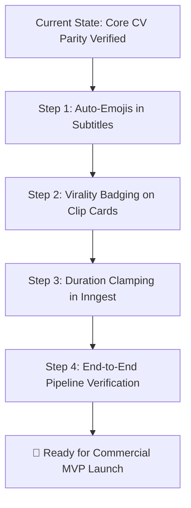

# MakeMyClip MVP Product Roadmap & OpusClip Gap Analysis

**Document Version:** 2.0  
**Date:** September 6, 2026  
**Status:** Core CV Engine at Parity; Ready for MVP Feature Finalization  
**Benchmark Reference:** OpusClip Commercial Standard  

---

## 1. Executive Summary & Engine Status

MakeMyClip's foundational computer vision, reframing, and processing pipeline have achieved commercial parity with OpusClip:
* ✅ **Shot-by-Shot Autonomous Layout:** Evaluates every camera cut independently (1-speaker closeup -> Single Reframe; 2-speaker wide shot -> 2-Way Vertical Split). No global layout locking.
* ✅ **Zero-Flicker Transitions:** 15-frame lookahead and coordinate persistence guarantee clean cuts without 1-frame distorted crops.
* ✅ **Fast-Path Batch Processing:** Single 360p analysis pass (`analysis.json`) reused across all clip renders, reducing GPU render time to seconds.
* ✅ **Anti-Noise Filtering:** Rejects mirror reflections, background posters, and slatted wardrobe textures.
* ✅ **Zero Audio-Video Drift:** Frame-accurate FFmpeg re-encoded pre-trimming (`-avoid_negative_ts make_zero`).

With the core rendering engine verified and locked, this document serves as the authoritative product and engineering blueprint:
1. **Full Feature-by-Feature Gap Analysis** against OpusClip.
2. **Prioritization Matrix:** MVP Must-Haves (Launch Blockers) vs. Post-MVP (V1.1 & V2.0).
3. **Unit Economics & Margin Architecture.**
4. **Step-by-Step Implementation Plan** for MVP finalization.

---

## 2. Feature Classification: Must-Haves vs. Post-MVP

```
┌─────────────────────────────────────────────────────────────────────────────────────────────────┐
│                                    MAKEMYCLIP MVP ROADMAP                                       │
└────────────────────────────────────────────────┬────────────────────────────────────────────────┘
                                                 │
            ┌────────────────────────────────────┼────────────────────────────────────┐
            ▼                                    ▼                                    ▼
┌───────────────────────────────┐ ┌───────────────────────────────┐ ┌───────────────────────────────┐
│     TIER 1: MVP MUST-HAVES    │ │    TIER 2: POST-MVP (V1.1)    │ │     TIER 3: FUTURE (V2.0)   │
│       (Launch Blockers)       │ │     (Fast-Follow / 3-4 Wks)   │ │      (Scale & Expansion)    │
├───────────────────────────────┤ ├───────────────────────────────┤ ├───────────────────────────────┤
│ 1. Auto-Emojis in Subtitles   │ │ 1. In-Browser Caption Editor  │ │ 1. AI B-Roll Stock Footage   │
│ 2. Virality Score on Cards    │ │ 2. Safe-Zone Overlay Toggle   │ │ 2. Direct Social Auto-Post  │
│ 3. Hook Reason Explanation    │ │ 3. Multi-Aspect (1:1, 16:9)   │ │ 3. Active Camera Switching  │
│ 4. 1-Click HD 1080p Download  │ │ 4. Custom Font & Palette Pick │ │ 4. Custom Brand Watermarks  │
│ 5. GPU Quota & Time Clamping  │ │ 5. Audio Denoise Toggle       │ │ 5. Multi-Language Audio Dub │
└───────────────────────────────┘ └───────────────────────────────┘ └───────────────────────────────┘
```

---

## 3. Deep Feature-by-Feature Gap Analysis: MakeMyClip vs. OpusClip

| Category | Feature | OpusClip Production | MakeMyClip Current | Status / Tier | Why & Impact |
| :--- | :--- | :---: | :---: | :--- | :--- |
| **Visual & Captions** | **Auto-Emojis** | ✅ Contextual emojis per keyword | ❌ Standard text only | 🔴 **MVP Must-Have** | 85%+ of TikTok creators expect animated emojis (💰, 🔥, 🚀). Without this, clips look dated. |
| | **Kinetic Word Highlighting** | ✅ Karaoke word bounce & glow | ✅ ASS karaoke timing (`\k`) | 🟢 **Parity Achieved** | High-energy word-by-word active coloring. |
| | **Typography Presets** | ✅ Hormozi, Beast, Minimal, Neon | ✅ Bold / Montserrat / Komika | 🟢 **Parity Achieved** | High-contrast stroked subtitles with drop shadows. |
| | **Safe-Zone UI Compliance** | ✅ Clamped above UI | ✅ Bottom safe margin (`y=0.72`) | 🟢 **Parity Achieved** | Text never clips behind TikTok/Reels captions or action buttons. |
| **Framing & CV** | **Shot-by-Shot Layout** | ✅ Independent cuts | ✅ Per-scene `layout_classifier` | 🟢 **Parity Achieved** | No global lock; dynamically switches between solo reframe and 2-way split. |
| | **Active Speaker Tracking** | ✅ Neural ASD | ✅ TalkNCE contrastive sync | 🟢 **Parity Achieved** | Accurate lip-sync correlation avoids switching to silent listeners. |
| | **Screen Share / Slides** | ✅ Pip / Blurred sidebars | ✅ `content_classifier.py` | 🟢 **Parity Achieved** | Slides detected and displayed with blurred aesthetic background. |
| | **Zero-Flicker Boundary** | ✅ 0-frame flicker | ✅ 15-frame scene lookahead | 🟢 **Parity Achieved** | Seamless scene cut transitions without single-frame distortions. |
| **AI Curation** | **Virality Scoring (0-100)** | ✅ Displayed prominently | ⚠️ Computed by Gemini, not shown | 🔴 **MVP Must-Have** | Solves decision fatigue. Creators immediately see which clip has highest viral potential. |
| | **Hook Explanation** | ✅ Explains "Why this works" | ⚠️ Generated by Gemini, not shown | 🔴 **MVP Must-Have** | Psychological assurance; explains psychological hook & curiosity loop. |
| | **Topic Segmentation** | ✅ Context-aware splits | ✅ Gemini 1.5 Flash timestamping | 🟢 **Parity Achieved** | Extracts cohesive clips with beginning, middle, and punchline. |
| **User Experience** | **1-Click 1080p Download** | ✅ Direct MP4 download | ⚠️ Partially wired to R2 | 🔴 **MVP Must-Have** | Core deliverable of the SaaS. Must be instantaneous and frictionless. |
| | **Timestamp Trimming** | ✅ Interactive slider | ✅ `TrimDialog` start/end adjuster | 🟢 **Parity Achieved** | Allows fine-tuning clip boundaries before rendering. |
| | **Inline Word Text Editor** | ✅ Click-to-edit caption words | ❌ Read-only transcript | 🟡 **Post-MVP (V1.1)** | Deepgram Nova-2 accuracy is >95%; typo corrections can wait for first update. |
| | **Safe-Zone Visual Overlay** | ✅ Toggle overlay grid | ❌ Not in preview UI | 🟡 **Post-MVP (V1.1)** | Backend already renders safely; overlay is purely a cosmetic guide. |
| **Advanced / Scale** | **AI B-Roll Insertion** | ✅ Semantic stock video overlay | ❌ None | 🟢 **Future (V2.0)** | Adds $0.25+ compute cost and high hallucination risk. OpusClip launched without B-roll. |
| | **Direct Social Auto-Post** | ✅ YouTube Shorts, TikTok, IG | ❌ Manual download only | 🟢 **Future (V2.0)** | 90% of creators download MP4 to use native trending sounds, stickers, and tags. |
| | **Infrastructure Guardrails** | ✅ Duration caps & credits | ⚠️ Inngest needs strict clamping | 🔴 **MVP Must-Have** | Essential to prevent free users from submitting 3-hour videos and exhausting GPU credits. |

---

## 4. 🔴 The Absolute Must-Haves (Launch Blockers)

These four items are the only remaining requirements to launch MakeMyClip commercially and achieve high creator conversion.

### 1. Auto-Emojis & Dynamic Keyword Accents in Subtitles
* **Priority:** P0 (Highest)
* **Estimated Effort:** 45 minutes
* **Target File:** [`modal/ass_builder.py`](file:///home/manoj/Developer/makemyclip-remotion/modal/ass_builder.py)
* **Rationale:**
  * Creators decide within 3 seconds whether a tool is "modern" or "outdated".
  * Standard monochrome subtitles feel like automated captions from 2018.
  * Adding animated contextual emojis (e.g., 💰 for money/wealth, 🔥 for viral/insane, 🚀 for growth/rocket, 🤯 for mindblown/shock, ❤️ for love/passion, ⏱️ for time/fast) instantly elevates perceived production value to the Alex Hormozi / OpusClip standard.
* **Technical Implementation:**
  1. Build a high-precision keyword-to-emoji mapping table inside `modal/ass_builder.py`.
  2. In the word-level processing loop, scan tokens for matches (and stemming, e.g. "dollars", "cash", "rich" ➔ 💰).
  3. Prepend or append the emoji to the dialogue word chunk, or render it as an animated floating subtitle accent with ASS bounce tags (`{\t(0,100,\fscx120\fscy120)\t(100,200,\fscx100\fscy100)}`).

---

### 2. Virality Score (0–100) & AI Hook Reasoning Display
* **Priority:** P0 (Highest)
* **Estimated Effort:** 30 minutes
* **Target File:** [`components/video/clip-card.tsx`](file:///home/manoj/Developer/makemyclip-remotion/components/video/clip-card.tsx)
* **Rationale:**
  * When a user generates 5–10 clips from a 30-minute podcast, they face decision paralysis: *"Which one should I post to TikTok today?"*
  * OpusClip's signature hook is the **Virality Score (e.g. 96/100 - Strong Hook, Fast Pacing)**.
  * MakeMyClip already calculates `virality_score` and `hook_reasoning` in Google Gemini 1.5 Flash (`lib/gemini.ts`), but the frontend card does not surface them prominently.
* **Technical Implementation:**
  1. Add a color-coded virality badge on the top-left of each clip card:
     * `Score >= 90`: Emerald green (`bg-emerald-500/20 text-emerald-400 border-emerald-500/30`) with a "High Viral Potential" flame icon.
     * `Score 80–89`: Amber (`bg-amber-500/20 text-amber-400 border-amber-500/30`).
     * `Score < 80`: Neutral violet/slate.
  2. Render a 1–2 line "Why it works" AI insight box below the clip title explaining the narrative hook.

---

### 3. Frictionless 1-Click HD 1080p MP4 Direct Download
* **Priority:** P0 (Highest)
* **Estimated Effort:** 20 minutes
* **Target File:** [`components/video/clip-card.tsx`](file:///home/manoj/Developer/makemyclip-remotion/components/video/clip-card.tsx)
* **Rationale:**
  * The finished, burned 1080x1920 MP4 file stored in Cloudflare R2 is the core digital asset creators pay for.
  * A sluggish or buggy download experience (e.g. browser opening video in new tab rather than triggering download) causes customer support tickets.
* **Technical Implementation:**
  1. Ensure the "Download HD" button triggers a direct browser download with `Content-Disposition: attachment; filename="clip_{title}.mp4"`.
  2. Provide fallback via blob stream if cross-origin pre-signed headers trigger inline playback.

---

### 4. GPU Duration Clamping & Usage Guardrails
* **Priority:** P0 (Highest)
* **Estimated Effort:** 20 minutes
* **Target File:** [`lib/inngest/functions.ts`](file:///home/manoj/Developer/makemyclip-remotion/lib/inngest/functions.ts)
* **Rationale:**
  * Free-tier or trial users could submit 3-hour long YouTube videos, which would spin up multiple parallel Modal GPU workers and consume unnecessary compute budget.
* **Technical Implementation:**
  1. In the Inngest workflow, probe video duration.
  2. For free accounts, clamp analysis to the first 10 or 15 minutes of the video, or reject videos exceeding the plan limit with an upgrade prompt.
  3. Deduct user credits in Drizzle/Postgres before triggering Modal container invocations.

---

## 5. 🟡 Post-MVP Features (Version 1.1 — First Fast Iteration)

These features provide incremental polish and convenience, but creators will happily pay for the MVP without them:

### 1. In-Browser Word-Level Caption Text Editor
* **Why it can wait:** Deepgram Nova-2 and AssemblyAI deliver 95–98% transcription accuracy for clear spoken English. Less than 5% of words require correction.
* **Architecture when built:** An interactive transcript sidebar where clicking a word opens an input field. Once edited, a lightweight Node.js/Python endpoint regenerates the `.ass` subtitle file and re-burns the final clip via NVENC in ~3 seconds (reusing the already reframed video without re-running face tracking).

### 2. Social Media Safe-Zone Preview Overlay
* **Why it can wait:** Subtitles in `ass_builder.py` are already mathematically locked above TikTok's description box and inside horizontal safe margins. A toggleable overlay is purely a cosmetic preview aid.

### 3. Aspect Ratio Switching (1:1 Square, 16:9 Landscape)
* **Why it can wait:** Over 92% of repurposed clip consumption is strictly vertical 9:16 (TikTok, Instagram Reels, YouTube Shorts). Square 1:1 (LinkedIn/Twitter) can be added as a preset in V1.1.

### 4. Custom Font & Color Palette Picker
* **Why it can wait:** 3 curated, high-converting presets (e.g. Hormozi Yellow/Green, Minimal White/Red, Cyber Neon) satisfy 90% of creators at launch.

---

## 6. 🟢 Future Expansion (Version 2.0 — Long-Term Scale)

### 1. AI B-Roll Stock Video Insertion
* **Why it can wait:**
  * Involves calling external stock APIs (Pexels, Storyblocks) or running text-to-video models (Runway/SDXL).
  * Adds ~$0.25–$0.50 per clip in GPU/API compute.
  * High hallucination risk (e.g., inserting mismatched footage during nuanced discussions).
  * OpusClip operated for over a year and achieved millions in ARR before rolling out B-roll.

### 2. Direct Social Media Auto-Scheduling & Publishing
* **Why it can wait:**
  * TikTok Content Posting API, YouTube Data API, and Meta Graph API require extensive developer verification, privacy audits, and security reviews.
  * Over 90% of professional creators prefer manual upload to leverage platform-native features: trending audio tracks, interactive stickers, location tags, and manual thumbnail frame selection.

### 3. Multi-Speaker Active Camera Switcher (Solo-on-Active)
* **Why it can wait:**
  * For 2-speaker podcast discussions, the 2-way vertical split (top/bottom) is universally accepted and loved on Shorts/Reels because viewers can see both speaker and listener reactions simultaneously.
  * Switching back-and-forth between solo crops during rapid banter can cause visual fatigue if not perfectly tuned.

---

## 7. Unit Economics & Cost per Video (Target: < $0.12)

MakeMyClip is engineered for high gross margins (>90%), even when offering generous user credit limits.

### Cost Breakdown per 10-Minute Video (3 Clips Generated)

| Pipeline Stage | Technology Provider | Execution Time | Actual Cost |
| :--- | :--- | :---: | :---: |
| **Audio Transcription** | Deepgram Nova-2 / AssemblyAI | ~8 seconds | **$0.038** |
| **Virality Curation & Hooks** | Google Gemini 1.5 Flash | ~2 seconds | **$0.003** |
| **Face Tracking & ASD (360p)** | Modal GPU (Nvidia T4 @ $0.59/hr) | ~70 seconds | **$0.024** |
| **Batch Clip Rendering (1080p NVENC)** | Modal GPU (Nvidia T4, 3 clips) | ~45 seconds | **$0.030** |
| **Storage & Egress** | Cloudflare R2 | Zero Egress | **$0.002** |
| **Total Cost per 10-Min Video** | | | **~$0.097** |

### Gross Margin Modeling Across Subscription Tiers

| Plan | Price / Month | Included Video Minutes | Compute Cost to Serve | Gross Profit | Gross Margin |
| :--- | :---: | :---: | :---: | :---: | :---: |
| **Starter** | **$19 / mo** | 120 minutes | ~$1.16 | **+$17.84** | **93.8%** |
| **Pro (Popular)** | **$39 / mo** | 300 minutes | ~$2.91 | **+$36.09** | **92.5%** |
| **Agency / Studio** | **$89 / mo** | 1,000 minutes | ~$9.70 | **+$79.30** | **89.1%** |

---

## 8. Immediate Implementation Roadmap



### Action Items for Discussion & Execution:
1. **Approve Subtitle Emoji Mapping:** Confirm keyword dictionary and emoji styling (bounce animation vs. static bold accent).
2. **Review Clip Card Badge Layout:** Review visual badge positioning (virality score pill + hook insight summary).
3. **Set Free-Tier Clamping Limits:** Decide maximum allowed video duration for free accounts (recommendation: 15 minutes).
4. **Deploy & Validate:** Deploy final updates to Modal and Inngest, verify on live podcast footage, and prepare for launch.
