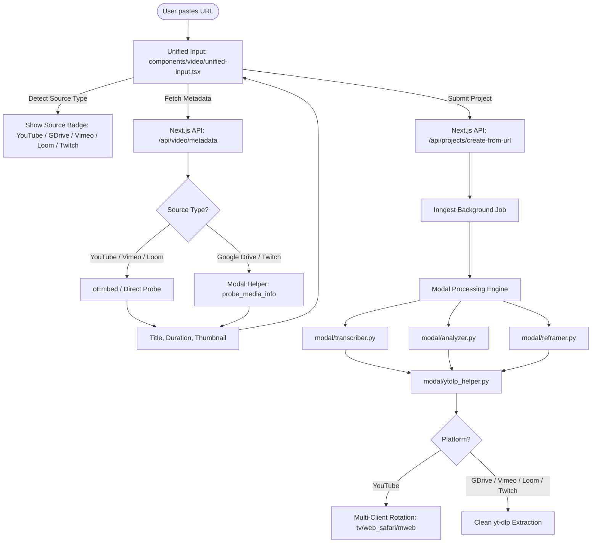

# Implementation Plan: Tier 1 & Tier 2 Video Source Support

This implementation plan details the architecture and step-by-step code modifications required to expand MakeMyClip from a YouTube-only clipper to supporting **Tier 1** and **Tier 2** video sources, matching platforms like Klap.app and Opus Clip.

---

## 1. Scope & Target Platforms

| Tier | Platform | Supported Formats / URL Shapes | Extractor / Method |
| :--- | :--- | :--- | :--- |
| **Tier 1** | **YouTube** | Standard (`watch?v=`), Short (`/shorts/`), Live, Embed, `youtu.be` | `yt-dlp` (YouTube multi-client rotation) |
| **Tier 1** | **Google Drive** | `drive.google.com/file/d/<ID>/view`, `drive.google.com/open?id=<ID>` | `yt-dlp` (`googledrive.py`, public link) |
| **Tier 1** | **Direct Files** | Local MP4, MOV, WebM uploads & Presigned CDN links | R2 Presigned / HTTP stream (Existing) |
| **Tier 2** | **Vimeo** | `vimeo.com/<ID>`, `player.vimeo.com/video/<ID>`, unlisted | `yt-dlp` (`vimeo.py`) |
| **Tier 2** | **Loom** | `loom.com/share/<ID>`, embed links | `yt-dlp` (`loom.py`) |
| **Tier 2** | **Twitch** | `clips.twitch.tv/<ID>`, `twitch.tv/<USER>/clip/<ID>`, `twitch.tv/videos/<ID>` | `yt-dlp` (`twitch.py`) |

---

## 2. End-to-End Architecture Flow



---

## 3. Step-by-Step Implementation

### Phase 1: Modal Backend Engine (`modal/`)

#### Step 1.1: Generalize URL Classification in [`modal/utils.py`](file:///home/manoj/Developer/makemyclip-remotion/modal/utils.py)
Replace the single `is_youtube_url()` check with a structured source classifier:
```python
# In modal/utils.py

SUPPORTED_PLATFORMS = {
    "youtube": ("youtube.com", "youtu.be"),
    "google_drive": ("drive.google.com",),
    "vimeo": ("vimeo.com",),
    "loom": ("loom.com",),
    "twitch": ("twitch.tv", "clips.twitch.tv"),
}

def detect_video_source(url: str | None) -> str:
    """Return platform key ('youtube', 'google_drive', 'vimeo', 'loom', 'twitch', 'direct', 'unknown')."""
    if not url:
        return "unknown"
    normalized = normalize_url(url).lower()
    for platform, domains in SUPPORTED_PLATFORMS.items():
        if any(d in normalized for d in domains):
            return platform
    if any(normalized.endswith(ext) for ext in (".mp4", ".webm", ".mov", ".mkv")):
        return "direct"
    return "unknown"

def is_ytdlp_supported_url(url: str) -> bool:
    """Return True if url can be processed by yt-dlp."""
    return detect_video_source(url) in ("youtube", "google_drive", "vimeo", "loom", "twitch")

def is_youtube_url(url: str) -> bool:
    """Retained for backwards compatibility."""
    return detect_video_source(url) == "youtube"
```

#### Step 1.2: Refactor [`modal/ytdlp_helper.py`](file:///home/manoj/Developer/makemyclip-remotion/modal/ytdlp_helper.py)
1. **Google Drive Link Sanitization**:
   Google Drive URLs often contain tracking parameters (`?usp=sharing` or `/view?usp=drivesdk`). Add a normalizer:
   ```python
   def sanitize_google_drive_url(url: str) -> str:
       # Ensure yt-dlp receives the canonical file view link: https://drive.google.com/file/d/<ID>/view
       import re
       match = re.search(r"/file/d/([a-zA-Z0-9_-]+)", url) or re.search(r"id=([a-zA-Z0-9_-]+)", url)
       if match:
           file_id = match.group(1)
           return f"https://drive.google.com/file/d/{file_id}/view"
       return url
   ```
2. **Strategy Separation**:
   In `download_video(vurl, tmpdir, ...)` and `download_audio(vurl, tmpdir)`:
   - If `source == "youtube"`: Run the existing 4 client-rotation strategies (`tv + web_safari`, `android_vr`, etc.) and PO-token handling.
   - If `source in ("google_drive", "vimeo", "loom", "twitch")`: Run a single, clean `yt-dlp` strategy without YouTube client overrides:
     ```python
     ydl_opts = {
         "outtmpl": f"{tmpdir}/%(title)s.%(ext)s",
         "quiet": False,
         "socket_timeout": 60,
         "retries": 3,
         "format": f"bestvideo[height<={target_res}]+bestaudio/best[height<={target_res}]/bestvideo+bestaudio/best",
         "merge_output_format": "mp4",
         "postprocessors": [{"key": "FFmpegVideoRemuxer", "preferedformat": "mp4"}],
     }
     ```
3. **Universal Metadata Extraction**:
   Rename/generalize `get_youtube_info(vurl)` to `get_media_info_ytdlp(vurl: str) -> dict`:
   - Returns `{ "title", "duration", "fps", "width", "height", "thumbnail" }` for any supported URL.
   - Expose as a Modal function `@app.function()` so the Next.js API can call it for Google Drive and Twitch metadata in 1 second.

#### Step 1.3: Update Modal Pipeline Callers
In:
- [`modal/transcriber.py`](file:///home/manoj/Developer/makemyclip-remotion/modal/transcriber.py#L310-L336)
- [`modal/analyzer.py`](file:///home/manoj/Developer/makemyclip-remotion/modal/analyzer.py#L255-L295)
- [`modal/reframer.py`](file:///home/manoj/Developer/makemyclip-remotion/modal/reframer.py#L1805-L1834)

Replace:
```python
if is_youtube_url(vurl):
    ...
```
With:
```python
if is_ytdlp_supported_url(vurl):
    # Downloads via yt-dlp (YouTube, Google Drive, Vimeo, Loom, Twitch)
    ...
elif vurl.startswith("http://") or vurl.startswith("https://"):
    # Direct CDN / raw MP4 file download
```

---

### Phase 2: Next.js API & Metadata Layer (`lib/` & `app/api/`)

#### Step 2.1: Create [`lib/video-sources.ts`](file:///home/manoj/Developer/makemyclip-remotion/lib/video-sources.ts)
A centralized TypeScript utility for client & server:
```typescript
export type SupportedPlatform =
  | "youtube"
  | "google_drive"
  | "vimeo"
  | "loom"
  | "twitch"
  | "direct"
  | "unsupported"

export function detectPlatform(url: string): SupportedPlatform {
  if (!url) return "unsupported"
  const u = url.toLowerCase()
  if (u.includes("youtube.com") || u.includes("youtu.be")) return "youtube"
  if (u.includes("drive.google.com")) return "google_drive"
  if (u.includes("vimeo.com")) return "vimeo"
  if (u.includes("loom.com")) return "loom"
  if (u.includes("twitch.tv") || u.includes("clips.twitch.tv")) return "twitch"
  if (/\.(mp4|webm|mov|mkv)(\?.*)?$/i.test(u)) return "direct"
  return "unsupported"
}

export function isSupportedVideoUrl(url: string): boolean {
  return detectPlatform(url) !== "unsupported"
}
```

#### Step 2.2: Universal Metadata Resolver in [`app/api/video/metadata/route.ts`](file:///home/manoj/Developer/makemyclip-remotion/app/api/video/metadata/route.ts)
Support fast metadata extraction for each platform:
1. **YouTube**: Continue using `fetchYouTubeMetadata` (watch page scrape + oEmbed fallback).
2. **Vimeo**: Fast oEmbed fetch (`https://vimeo.com/api/oembed.json?url=...`). Returns `title`, `duration`, `thumbnail_url`.
3. **Loom**: Fast oEmbed fetch (`https://www.loom.com/v1/oembed?url=...`). Returns `title`, `thumbnail_url`.
4. **Google Drive & Twitch**: Call Modal's lightweight `probe_media_info` function or extract file ID and fetch duration/title.

#### Step 2.3: Update Project Creation in [`app/api/projects/create-from-url/route.ts`](file:///home/manoj/Developer/makemyclip-remotion/app/api/projects/create-from-url/route.ts)
- Replace `extractYouTubeVideoId` check with `isSupportedVideoUrl()`.
- Persist `sourcePlatform` (e.g. `"youtube"`, `"google_drive"`, `"vimeo"`, `"loom"`, `"twitch"`) in project metadata.

---

### Phase 3: Frontend UX in [`components/video/unified-input.tsx`](file:///home/manoj/Developer/makemyclip-remotion/components/video/unified-input.tsx)

#### Step 3.1: Support All 5 Platforms in Input Field
Replace `isValidYoutubeUrl(url)` with `isSupportedVideoUrl(url)`.

#### Step 3.2: Visual Platform Badges & Icons
When the user pastes a URL, dynamically render a badge next to the input box:
-  **YouTube**: Red YouTube icon
-  **Google Drive**: Drive icon + hint: *"Ensure sharing is set to 'Anyone with link'"*
-  **Vimeo**: Blue Vimeo badge
-  **Loom**: Purple Loom badge
-  **Twitch**: Purple Twitch badge

#### Step 3.3: Inline Validation Guidance
- If user pastes a restricted Google Drive link without public permissions, display:
  > *"Google Drive file is restricted. Please change link permissions to 'Anyone with the link can view'."*
- If user pastes a DRM service (e.g. Netflix, Disney+):
  > *"Copyright-protected streaming services cannot be imported. Please upload a local screen recording."*

---

## 4. Verification & Testing Matrix

| Platform | Test URL Format | Expected Output | Verification Point |
| :--- | :--- | :--- | :--- |
| **YouTube** | `https://www.youtube.com/watch?v=...` | Title, Duration, 720p/1080p MP4 | Verify no regressions in YouTube player_client rotation. |
| **Google Drive** | `https://drive.google.com/file/d/.../view?usp=sharing` | Downloaded MP4 with virus-scan confirmation bypass | Ensure large files (>100MB) download without token prompt failure. |
| **Vimeo** | `https://vimeo.com/76979871` | Title, Duration, 1080p MP4 stream | Verify metadata comes from oEmbed and video downloads. |
| **Loom** | `https://www.loom.com/share/...` | Title, 720p MP4 | Verify audio and video download cleanly without auth error. |
| **Twitch Clip** | `https://clips.twitch.tv/...` | Title, Duration, High-res MP4 | Verify audio tracks align with video stream. |
| **Twitch VOD** | `https://www.twitch.tv/videos/...` | Padded segment download for selected range | Verify segment-offset seeking works in `download_video`. |

---

## 5. Timeline & Task Breakdown

1. **Step 1 (Modal)**: Update `modal/utils.py` and `modal/ytdlp_helper.py` to route non-YouTube URLs through default `yt-dlp` extraction.
2. **Step 2 (Modal Callers)**: Switch `transcriber.py`, `analyzer.py`, and `reframer.py` from `is_youtube_url` to `is_ytdlp_supported_url`.
3. **Step 3 (API)**: Implement `lib/video-sources.ts` and update `/api/video/metadata` and `/api/projects/create-from-url`.
4. **Step 4 (Frontend)**: Update `unified-input.tsx` with multi-platform validation and UI badges.
5. **Step 5 (QA)**: Run test clips from all 5 platforms through the full pipeline (transcription -> face tracking -> reframing).
