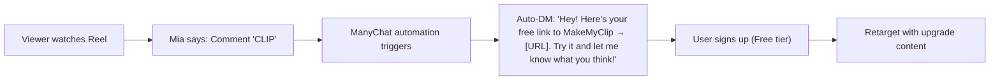

# MakeMyClip — Product & UGC Strategy Document

> **Purpose:** Complete reference for product positioning, Tier 1 audience targeting, and UGC female persona design for Instagram Reels content.

---

## 1. Product Title & Tagline

| Field | Value |
| :--- | :--- |
| **Product Name** | MakeMyClip |
| **Tagline** | *Get 10+ Viral Clips from One Video in 1 Click.* |
| **Category** | AI-Powered Video Repurposing Tool |
| **Platforms Served** | Instagram Reels · TikTok · YouTube Shorts · LinkedIn Video |
| **Pricing** | Free (10 min/mo) → Creator $19/mo → Power $49/mo + credit packs |

---

## 2. Brief Product Description

MakeMyClip is an AI-powered video clipping, auto-reframing, and subtitling tool that turns long-form content (podcasts, webinars, streams, interviews, talking-head videos) into ready-to-post vertical clips in minutes — not hours.

**What it does in one sentence:**  
*Upload a long video or paste a YouTube link, and the AI finds the most viral moments, reframes them to 9:16, burns animated captions, and gives you 10+ download-ready clips.*

### Core Capabilities

1. **AI Highlight & Virality Detector** — Scans the entire video, identifies high-engagement segments, and scores each clip's viral potential (1–100) so creators never miss a moment worth posting.
2. **AI Speaker Tracking & Auto-Reframe** — Converts 16:9 landscape footage to 9:16 vertical with intelligent face tracking that keeps the active speaker perfectly centered, including split-screen for dual-speaker setups.
3. **Auto-Subtitles & Dynamic Captions** — 97%+ accuracy transcription in 30+ languages with word-by-word animated captions, auto-emojis, and 15+ trendy preset styles (Hormozi, MrBeast, Neon Glow, Cinematic, etc.).
4. **Creative Preset Library** — One-click caption templates styled after the biggest creators on the internet. Apply, preview, and export in seconds.
5. **Multi-Platform Export** — Download clips in Full HD (1080p) or 4K, optimized for every major short-form platform.

### What MakeMyClip is NOT
- It does **not** auto-post to social media. It is a download-first tool — creators get full-quality files to post on their own schedule.
- It is **not** a full video editor. No timelines, no keyframes, no learning curve. It is built for speed and output volume.

---

## 3. Target Audience — Tier 1 Countries (In-Depth)

### 3.1 Geographic Focus

| Region | Key Markets | Language | Currency |
| :--- | :--- | :--- | :--- |
| **North America** | United States (NYC, LA, SF, Austin, Miami), Canada (Toronto, Vancouver) | English | USD / CAD |
| **Europe** | United Kingdom (London), Germany (Berlin), Netherlands, Nordics | English / Local | GBP / EUR |
| **Asia-Pacific** | Australia (Sydney, Melbourne), New Zealand, Singapore | English | AUD / SGD |

> [!IMPORTANT]
> All marketing content, pricing references, and cultural references must feel native to these markets. No regional slang, no local-only references. The tone is **global, premium, and tech-forward.**

---

### 3.2 Audience Segments (Deep Dive)

#### Segment A: The Solo Content Creator (The Biggest Segment)

| Attribute | Detail |
| :--- | :--- |
| **Who** | YouTube creators, podcast hosts, talking-head educators, course sellers |
| **Age** | 22–38 |
| **Gender Split** | 55% male, 45% female |
| **Income** | $40K–$120K/year (or equivalent) |
| **Platforms** | YouTube (primary), Instagram, TikTok, LinkedIn |
| **Content Type** | Long-form talking-head, interviews, educational rants, course promos |
| **Tech Comfort** | Moderate — uses Canva, CapCut, maybe Premiere; not a professional editor |
| **Core Pain** | They know they need to post short-form daily but spend 3–5 hours per video editing clips manually. Their growth is bottlenecked by production speed, not ideas. |
| **Emotional Trigger** | Frustration ("I film great content but can't keep up with the posting pace"), FOMO ("Everyone else posts 2x a day and I can barely do 3 a week") |
| **What They Want** | Upload once → get 10 clips → download → post. No learning curve. No timeline scrubbing. |
| **Willingness to Pay** | $19–$49/month is a no-brainer if it replaces even 1 hour of editing per week |
| **Where They Discover Tools** | Instagram Reels, YouTube "best tools" videos, Twitter/X threads, Product Hunt, Reddit r/NewTubers |

**Hook that resonates:**
> *"I turned a 45-minute YouTube video into 12 Reels in under 2 minutes. No editor. No timeline. Just AI."*

---

#### Segment B: The Social Media Agency / Freelancer

| Attribute | Detail |
| :--- | :--- |
| **Who** | Small agency owners (2–10 person teams), freelance social media managers, virtual assistants handling content |
| **Age** | 25–40 |
| **Income** | $60K–$200K/year revenue |
| **Clients** | Coaches, consultants, small brands, podcasters, real estate agents |
| **Core Pain** | They charge clients $1,500–$5,000/month for content management. The bottleneck is clip volume — a human editor can do maybe 3–5 clips per day. They need to 10x output without hiring more editors. |
| **Emotional Trigger** | Margin pressure ("I'm spending $800 on an editor for work that takes 2 minutes with AI"), scaling anxiety ("I can't take on more clients because I don't have the bandwidth") |
| **What They Want** | A white-label-feeling workflow. Upload client podcast → download 15 clips → deliver to client → invoice $2,000. Repeat across 8 clients. |
| **Willingness to Pay** | $49/month (Power plan) or heavy credit pack usage. They think in ROI — if the tool saves $800/month in editor costs, $49 is trivial. |

**Hook that resonates:**
> *"The $49 tool replacing $3,000/month video editors at social media agencies."*

---

#### Segment C: The Podcaster / Interview-Format Creator

| Attribute | Detail |
| :--- | :--- |
| **Who** | Podcast hosts with 1K–100K subscribers, interview-based YouTube creators |
| **Age** | 28–45 |
| **Content** | Long interviews (30–90 minutes), typically 2 speakers on camera |
| **Core Pain** | They record once per week and know the episode contains 5–10 great clip-worthy moments, but they don't have the time (or budget) to find and cut those moments. Most episodes get posted as-is and die with zero social distribution. |
| **Emotional Trigger** | Wasted potential ("Every episode has golden moments that nobody ever sees because I can't clip them fast enough") |
| **What They Want** | The AI virality detector is their killer feature. They want the AI to tell them *which* moments are worth posting, not just chop randomly. Speaker tracking for clean 9:16 framing is the second priority. |
| **Willingness to Pay** | $19/month (Creator plan). Most podcasters are cost-conscious unless they're monetized. |

**Hook that resonates:**
> *"This AI watched my entire 60-minute podcast and found the 8 moments most likely to go viral. Here's what happened when I posted them."*

---

#### Segment D: The SaaS Founder / B2B Marketer

| Attribute | Detail |
| :--- | :--- |
| **Who** | Indie hackers, startup founders, developer advocates, B2B marketers |
| **Age** | 26–42 |
| **Platforms** | LinkedIn (primary), Twitter/X, YouTube |
| **Content** | Product demos, webinar recordings, founder vlogs, team talks |
| **Core Pain** | They have hours of webinar and demo content sitting unused. They know short-form is the play for organic growth but don't have a content team. |
| **Emotional Trigger** | Competitive pressure ("Our competitor posts daily on LinkedIn and is getting all the attention. We posted nothing this month.") |
| **What They Want** | Turn a 45-min webinar recording into 8 clean clips with professional captions to drip across LinkedIn and Twitter. The "Clean Glow" or "Podcast Pro" preset — nothing flashy, just professional. |
| **Willingness to Pay** | $19–$49/month. Marketing budget line item. |

**Hook that resonates:**
> *"We recorded a 40-min product demo. AI turned it into 10 LinkedIn clips. One of them drove 47 sign-ups."*

---

#### Segment E: The Twitch Streamer / Gaming Creator

| Attribute | Detail |
| :--- | :--- |
| **Who** | Twitch/YouTube streamers, gaming content creators |
| **Age** | 18–30 |
| **Core Pain** | They stream for 4–6 hours. The best moments (fails, wins, funny reactions) are buried in hours of footage. Manually clipping is painful and the landscape format looks terrible on mobile platforms. |
| **Emotional Trigger** | Lost followers ("I had a clip-worthy moment during my stream but by the time I edited it, the moment was cold") |
| **What They Want** | Fast turnaround. Upload VOD → AI finds the hype moments → auto-reframe to vertical → download and post before the moment goes stale. Neon Glow / Impact presets match gaming aesthetics. |
| **Willingness to Pay** | Free tier to start, upgrade to Creator ($19) once they see results. Price-sensitive but volume-driven. |

**Hook that resonates:**
> *"Stop posting flat Twitch clips on Instagram. This AI reframes them perfectly in 30 seconds."*

---

### 3.3 Psychographic Commonalities (Across All Segments)

Every MakeMyClip user shares these traits:

1. **Volume Obsession** — They understand that posting frequency directly correlates with growth. They want to post 1–2x per day but can't sustain that manually.
2. **Time Scarcity** — They are not full-time editors. Editing is the task they want to eliminate, not improve.
3. **Quality Expectation** — They've seen Hormozi-style captions, MrBeast-style hooks, and MKBHD-style clean edits. They want that level of polish without the skill or the team.
4. **Platform Pressure** — Instagram, TikTok, and YouTube Shorts algorithms reward daily posting. They feel the pressure to keep up or become irrelevant.
5. **ROI-Driven** — They justify tool costs against time saved or editor costs eliminated. A $19/month tool that saves 10 hours/month is a no-brainer.

---

## 4. UGC Female Persona — "Mia" (The Global Creator Coach)

> [!NOTE]
> This persona is designed for a UGC-style female character who will be the face of MakeMyClip's Instagram Reels. She needs to feel authentic, relatable, and aspirational to Tier 1 audiences across the US, UK, Canada, and Australia.

### 4.1 Identity Overview

| Field | Detail |
| :--- | :--- |
| **Name** | Mia (universally recognizable across all Tier 1 markets) |
| **Age** | 25–28 |
| **Ethnicity** | Ambiguously diverse — could be perceived as mixed-race, Southern European, Latin, or South Asian. The goal is broad relatability across multicultural Tier 1 cities. |
| **Location Feel** | NYC loft / London flat / LA studio apartment. Never a specific city — always an aspirational, globally-coded urban environment. |
| **Role / Title** | "Content Strategist" or "Creator Coach" — she positions herself as someone who has already figured out the system and is sharing her workflow. |
| **Vibe in One Line** | *"Your cool, sharp friend who works in tech and always knows the best tools before everyone else."* |

---

### 4.2 Visual & Aesthetic Identity

#### Appearance
- **Hair:** Shoulder-length, slightly textured or wavy. Natural tones (dark brown, warm brunette). No extreme colors — the look is polished but approachable.
- **Makeup:** Minimal and dewy. Think "no-makeup makeup" — clean skin, light brow fill, nude lip, maybe a subtle highlight on cheekbones. Never heavy or glam.
- **Accessories:** Small gold hoop earrings or thin gold chain. A simple analog watch. No loud branding.
- **Glasses (optional):** Wire-frame or clear-frame glasses for certain "work mode" clips to reinforce the tech-smart persona.

#### Wardrobe (Capsule Collection for Filming)
The wardrobe should rotate between 4–5 core looks to maintain consistency while avoiding "uniform" monotony:

| Look | Description | When to Use |
| :--- | :--- | :--- |
| **The Neutral Knit** | Oversized cream/oatmeal knit sweater, clean neckline | Talking-head hooks, personal stories |
| **The Black Turtleneck** | Slim-fit black turtleneck (Steve Jobs meets editorial) | Product demos, "secret hack" Reels |
| **The Linen Button-Up** | Relaxed off-white or sage linen shirt, sleeves rolled | Casual tips, "let me show you something" |
| **The Minimal Tee** | High-quality plain white or slate-grey crewneck tee | Quick tips, reply videos, duets |
| **The Blazer Pop** | Oversized beige or charcoal blazer over a simple top | Authority pieces, case studies, "agency hack" Reels |

> [!TIP]
> **Key Rule:** No visible logos, no fast-fashion patterns, no bright neon colors. The aesthetic is **Aritzia / COS / Everlane** — elevated basics. This reads "premium" in NYC, London, Sydney, and Toronto simultaneously.

#### Environment / Set Design

**Primary Set: "The Creator Desk"**
- A clean, warm-toned desk setup (birch or walnut desk, not glass)
- One large monitor displaying MakeMyClip's dashboard (dark mode preferred for contrast on camera)
- Soft diffused key light (warm white, never harsh blue)
- Background: floating shelves with 2–3 books (design/business titles), a small plant, maybe a ceramic mug
- Audio: Shure MV7 or Rode NT-USB Mini visible on desk (signals credibility without being distracting)

**Secondary Set: "The Couch Lean"**
- Sitting on a neutral-toned couch or floor cushion with a laptop on lap
- Used for more casual, personal, "let me tell you something" style hooks
- Natural window light preferred

**Tertiary Set: "The Walk-and-Talk"**
- Urban outdoor B-roll for transitional shots (walking through a well-lit city neighborhood, coffee shop establishing shots)
- Only used as cutaway footage, never as the primary filming location

---

### 4.3 Voice, Tone & Speech Patterns

#### Speaking Style
- **Pace:** Fast but articulate. She speaks at 160–180 WPM (the sweet spot for Reels retention). Not rushed — just energized.
- **Tone:** Confident, slightly playful, occasionally sarcastic. She's teaching but never lecturing. It's like explaining something cool to a friend who asked.
- **Accent:** Neutral American English or neutral British RP. Zero regional dialect. Think: "could be from any major English-speaking city."
- **Filler Words:** Minimal. She uses brief, punchy pauses instead of "um" or "like."

#### Vocabulary Rules

| Always Use | Never Use |
| :--- | :--- |
| "repurpose," "scale," "workflow" | "jugaad," "hack-life," "grind" |
| "retention rate," "virality score" | "blow up," "go crazy" |
| "clips," "shorts," "vertical content" | "edits," "montages" |
| "creator economy," "content velocity" | "hustle culture," "boss babe" |
| "ROI," "margins," "conversion" | "make bank," "stack bread" |
| Dollar amounts in USD | Local currency equivalents |

#### Signature Phrases (Brand Anchors)
These phrases should recur across Reels to build brand association:

1. *"One video. Ten clips. Zero editing."*
2. *"This is what your content workflow should look like in 2026."*
3. *"Stop editing. Start shipping."*
4. *"Comment 'CLIP' and I'll send you the link."*
5. *"Let me show you something that's going to save you 5 hours this week."*

---

### 4.4 Content Archetypes (Reel Formats Mia Films)

#### Format 1: "The Tool Demo" (40% of content)

**Structure:**
```
[0-2s]  Mia at desk, looking at camera. Hook text overlay appears.
[2-8s]  States the problem: "You're spending 3 hours editing clips manually."
[8-22s] Screen recording: pastes YouTube link → AI processes → clips appear
[22-28s] Shows the output: plays a finished clip full-screen
[28-32s] Back to camera: "One click. Ten clips. Link in comments."
```

**Example Script:**
> *"If you're still slicing up your podcast manually, you need to see this. I just pasted a YouTube link, clicked one button, and got 11 clips — all reframed, all captioned, all scored for virality. Look at this. [shows output] That took literally 90 seconds. Comment 'CLIP' and I'll send you the free link."*

---

#### Format 2: "The Before/After" (25% of content)

**Structure:**
```
[0-2s]  Split screen text: "RAW ← → AI REFRAMED"
[2-12s] Left side: raw landscape podcast footage (boring, flat, tiny faces)
        Right side: vertical MakeMyClip output (centered speaker, bold captions, emojis)
[12-18s] Mia appears: "Same video. Completely different engagement."
[18-22s] CTA: "Try it free. Comment 'CLIP'."
```

---

#### Format 3: "The Preset Showcase" (15% of content)

**Structure:**
```
[0-2s]  "Which caption style matches YOUR brand?"
[2-15s] Quick cuts showing the same clip with different presets:
        → Hormozi (Money Mode) — for coaches and finance creators
        → Neon Glow — for gamers and tech
        → Cinematic — for filmmakers and premium brands
        → Clean Glow — for SaaS and B2B
[15-20s] "15+ styles. One click each. All free to try."
```

---

#### Format 4: "The Myth Buster" (10% of content)

**Structure:**
```
[0-2s]  "WRONG." or "This is a lie." (confrontational text overlay)
[2-8s]  States the myth: "You need a $3,000/month editor to post daily Reels."
[8-18s] Shows the alternative workflow using MakeMyClip
[18-22s] "The truth? You need one AI tool and 10 minutes."
```

---

#### Format 5: "The Hot Take / Opinion" (10% of content)

**Structure:**
```
[0-2s]  Mia on couch, casual. "Unpopular opinion..."
[2-12s] States a strong opinion about content creation
        (e.g., "You don't need better ideas. You need faster distribution.")
[12-18s] Ties it back to the tool naturally (not hard-sell)
[18-22s] Engagement CTA: "Agree or disagree? Drop a comment."
```

---

### 4.5 Weekly Content Calendar for Mia

| Day | Format | Topic Example |
| :--- | :--- | :--- |
| **Monday** | Tool Demo | "I clipped a Huberman Lab episode in 90 seconds" |
| **Tuesday** | Before/After | "Raw podcast → 9:16 AI reframe comparison" |
| **Wednesday** | Hot Take / Opinion | "Why most creators fail at short-form (it's not ideas)" |
| **Thursday** | Tool Demo | "Testing the Hormozi caption preset on a finance clip" |
| **Friday** | Preset Showcase | "5 caption styles for 5 different niches" |
| **Saturday** | Myth Buster | "You DON'T need Premiere Pro to make Reels" |
| **Sunday** | Before/After or Carousel Recap | "This week's best AI-generated clips" |

> [!IMPORTANT]
> **Posting Schedule (Tier 1 Timezone Optimization):**
> - **Primary Window:** 8:00 AM – 10:00 AM EST (catches NYC, London afternoon, Australian evening)
> - **Secondary Window:** 5:00 PM – 7:00 PM EST (catches West Coast afternoon, London late night)
> - **Frequency:** 5–7 Reels per week minimum

---

### 4.6 Mia's CTA Strategy (Comment-to-DM Funnel)

Every Reel ends with a **comment-trigger CTA**, not a "link in bio" redirect:

**The Flow:**


**Why this works:**
1. Comments boost engagement signals → Instagram pushes the Reel to Explore
2. DM link has significantly higher click-through than bio link
3. The DM feels personal, increasing trust and conversion
4. Each comment creates a retargetable audience for future campaigns

---

### 4.7 Hashtag Strategy (Optimized for Tier 1 Discovery)

**Primary (use on every Reel):**
`#aivideoeditor` `#contentrepurposing` `#reelstips` `#shortformvideo` `#contentcreator`

**Niche Rotation (pick 3–5 per Reel based on topic):**
`#podcastclips` `#podcastmarketing` `#twitchclips` `#youtubeshots` `#linkedinvideo` `#saasmarketing` `#creatoreconomy` `#videoeditingtips` `#socialmediaagency` `#contentworkflow`

**Broad Reach (pick 2–3 per Reel):**
`#socialmediatips` `#growoninstagram` `#instagramtips` `#digitalmarketing` `#onlinebusiness`

---

## 5. Key Metrics to Track

| Metric | Target (Month 1–3) | Why It Matters |
| :--- | :--- | :--- |
| Reel Views | 50K–200K per Reel | Measures content-market fit |
| Comment Rate | 3–5% of views | Indicates CTA effectiveness |
| DM Conversion (comment → DM click) | 40–60% | Measures funnel health |
| Sign-up Rate (DM click → free account) | 15–25% | Measures landing page conversion |
| Free → Paid Conversion | 5–10% within 14 days | Measures product-market fit |
| Follower Growth | +2,000–5,000/month | Measures brand building momentum |

---

> [!TIP]
> **The Golden Rule for Mia's Content:** Every Reel should pass the "Would I share this with a creator friend?" test. If it feels like an ad, it fails. If it feels like a genuinely useful tip that happens to feature MakeMyClip, it wins.
