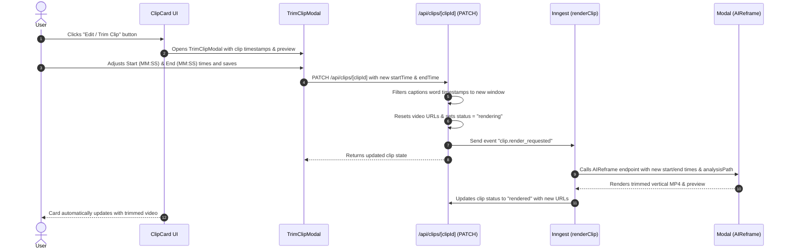

# Clip Trimming Feature Implementation Plan

Enable users to trim clip start and end timestamps directly from the `ClipCard` interface, triggering a re-slice and re-frame on the Modal backend pipeline to generate updated high-quality preview and export videos.

## Proposed Architecture & Workflow

---

## User Review Required

> [!NOTE]
> Trimming a clip modifies its `startTime` and `endTime` in the original source video. Because the video segment changes, Modal will re-frame and re-render the vertical MP4. Previous HD export files for this clip will be invalidated and cleared so users can re-export the newly trimmed clip.

---

## Open Questions

None. The system already supports full face-tracking re-framing per segment via Modal and Inngest.

---

## Proposed Changes

### Dashboard & Video Components

#### [NEW] [trim-clip-modal.tsx](file:///home/manoj/Developer/makemyclip-remotion/components/video/trim-clip-modal.tsx)
- Create a clean modal dialog for clip editing and trimming:
  - Video preview player with timeline scrub controls.
  - Start Time & End Time range inputs (in seconds and formatted `MM:SS`).
  - Clip duration preview banner (e.g. `New Duration: 35s`).
  - Title editing field.
  - "Save & Trim Clip" button with loading spinner state.

#### [MODIFY] [clip-card.tsx](file:///home/manoj/Developer/makemyclip-remotion/components/video/clip-card.tsx)
- Add an **"Edit / Trim"** button to the action bar of `ClipCard` (using `Scissors` / `Sliders` icon).
- Bind the button click to invoke `onEdit(clip)`.

#### [MODIFY] [project-detail-client.tsx](file:///home/manoj/Developer/makemyclip-remotion/app/(dashboard)/projects/[projectId]/project-detail-client.tsx)
- Connect `activeEditClip` state to render `<TrimClipModal>` when a clip is selected for editing.
- Pass `onSave` handler that calls `PATCH /api/clips/[clipId]`, optimistically updates the clip in state to `status: "rendering"`, and shows a toast notification.

---

### Backend API & Background Workers

#### [MODIFY] [route.ts](file:///home/manoj/Developer/makemyclip-remotion/app/api/clips/[clipId]/route.ts)
- Update `PATCH` handler to accept `startTime` and `endTime`.
- When timestamps change:
  - Validate `startTime >= 0` and `endTime > startTime`.
  - Fetch full project transcript words and slice captions matching the new timestamp window `[startTime, endTime]`.
  - Clear `originalVideoUrl`, `previewVideoUrl`, and `captionVideoUrl`.
  - Set `status = "rendering"` and `renderStatus = "Trimming clip..."`.
  - Dispatch `inngest.send({ name: "clip.render_requested", data: { clipId } })`.

#### [MODIFY] [functions.ts](file:///home/manoj/Developer/makemyclip-remotion/lib/inngest/functions.ts)
- Update `renderClip` to include `analysis_url: project.analysisPath || null` in the request payload to Modal when `originalVideoUrl` is null. This allows Modal to reuse the pre-calculated face tracking and active-speaker analysis for instant re-framing during trimming.

---

## Verification Plan

### Automated Tests
- Build test: Run `npm run build` or typecheck to ensure all components and API routes compile cleanly with zero TypeScript errors.

### Manual Verification
- Open a project detail page with generated clips.
- Click the "Edit / Trim" button on a clip card.
- Verify the trim modal opens with video preview, current start/end times, and duration.
- Change start/end timestamps and click "Save & Trim Clip".
- Observe:
  - Optimistic UI state updates the card to "Trimming clip...".
  - Backend API triggers Modal re-frame.
  - Project status polling receives updated rendered URLs and updates the preview video on the clip card.
