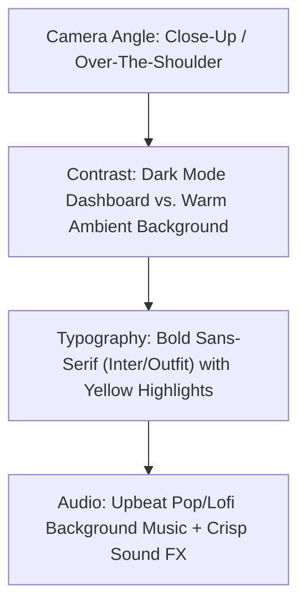

# UGC Demo Analysis & MakeMyClip Remix Strategy

This document breaks down the structure and psychology of the scraped Instagram Reel demo (`scrapes/instagram_2026-07-01_093840_e248ca1c/demo.mp4`) and presents an actionable, high-converting remix strategy customized for **MakeMyClip** starring our UGC persona, **Mia**.

---

## 1. Analysis of the Original Demo Video (`demo.mp4`)

### Spoken & Visual Storyboard
The original video utilizes a silent but highly engaging visual tutorial format backed by energetic background music:

| Timestamp | Visual Elements on Screen | On-Screen Text Overlay | Psychological Triggers & Engagement Factors |
| :--- | :--- | :--- | :--- |
| **0:00 - 0:02** | Close-up of a laptop screen. The cursor highlights and copies the URL of a popular Instagram Reel. | **Copy URL of any viral video** *(White text, yellow highlight box)* | **Curiosity & Utility:** Signals an actionable "cheat code." Promises a way to leverage existing viral success. |
| **0:02 - 0:03** | A new tab is opened; the user types `yorby.ai` into the browser address bar. | **Go here** *(White text, yellow highlight box)* | **Directness & Frictionless Transition:** Immediately shows the exact destination, removing guesswork. |
| **0:03 - 0:05** | The user clicks "Content Remix" on the dashboard sidebar and pastes the copied URL into the input field. | **Hit “content remix” & Paste in URL** *(White/yellow box)* | **Ease of Use:** Demystifies the input process. The action is quick and requires only a few clicks. |
| **0:05 - 0:07** | A clean loading overlay appears showing progress indicators (analyzing hooks, processing). | **It will analyze why the video went viral** *(White/yellow box)* | **AI Magic Factor:** Explains the complex technology in simple, high-value terms. Creates anticipation. |
| **0:07 - 0:11** | The screen transitions to show a fully populated script complete with a hook angle, body copy, and visual suggestions. | **Then ask the AI to use the exact script but for your own...** <br>**Better than ChatGPT!** *(Bottom overlay)* | **Gratification & Contrast:** Showcases a high-quality final result in seconds. Directly anchors against ChatGPT to establish superiority. |

### Why This Format is Winning (The Psychology)
1. **Show, Don't Tell:** Instead of talking about what the tool *can* do, it *demonstrates* it happening in real-time. This builds immediate credibility.
2. **Speed & High-Tempo Pacing:** Every transition takes under 2 seconds. The rapid pacing creates an impression that the tool operates at lightning speed, respecting the viewer's time.
3. **Contrast-Enhanced Text:** The yellow highlight behind white text mimics standard marker highlights, instantly drawing the eye to the key instruction.
4. **Zero Fluff:** No intro, no "hey guys," no preamble. It starts directly with the action.

---

## 2. MakeMyClip Remix Script

This script is designed for **Mia** (our 25-28 year old Content Strategist persona). It adapts the exact pacing, visual transitions, and text styles of the original demo for MakeMyClip.

### Script Details
*   **Target Persona:** Mia (Energetic, tech-forward, wearing an elevated oatmeal knit sweater, speaking with a neutral, clear accent).
*   **Aesthetic & Style:** Warm, high-end loft desk setup. A large monitor displaying the MakeMyClip dark mode dashboard.
*   **Key CTA:** Comment-to-DM funnel (Comment **'CLIP'**).

```carousel
### 0:00 - 0:02 | The Hook
**Visual:** Close-up of Mia's hand (clean nails, simple gold ring) copying a YouTube link of a long podcast interview.
**Text Overlay:** "If you edit videos, STOP doing this manually." *(White text, yellow highlight)*
**Audio (Mia - Energetic):** "If you are still manual-editing your vertical clips... stop. Just copy the link."
**Sound Effect:** Keyboard copy shortcut sound (`Cmd + C`).
<!-- slide -->
### 0:02 - 0:03 | The Destination
**Visual:** Quick cut to the browser tab. The cursor types `makemyclip.ai` into the address bar.
**Text Overlay:** "Go here: MakeMyClip.ai" *(White text, yellow highlight)*
**Audio (Mia):** "And go to MakeMyClip."
<!-- slide -->
### 0:03 - 0:05 | The Input
**Visual:** Zoomed-in shot of the dashboard. The cursor pastes the YouTube link and clicks a bright, glowing purple "Generate Clips" button.
**Text Overlay:** "Paste link & click 'Generate'" *(White text, yellow highlight)*
**Audio (Mia):** "Paste your long video link right here, click one button."
**Sound Effect:** Tactile mouse click sound.
<!-- slide -->
### 0:05 - 0:07 | The AI Engine
**Visual:** A modern, premium processing animation showing "Detecting high-engagement hooks...", "Reframing to 9:16 vertical...", and "Adding animated subtitles...".
**Text Overlay:** "AI automatically finds viral hooks & auto-reframes to 9:16!" *(White text, yellow highlight)*
**Audio (Mia):** "The AI immediately scans for viral hooks, reframes it to vertical, and generates captions."
<!-- slide -->
### 0:07 - 0:11 | The Payoff & CTA
**Visual:** The dashboard loads a list of 10+ perfectly cut vertical clips with bold, animated "Hormozi-style" captions. The cursor clicks on one, playing a snippet of the speaker perfectly centered in vertical frame.
**Text Overlay 1 (Top):** "Get 10+ viral clips in 1 click!" *(White text, yellow highlight)*
**Text Overlay 2 (Bottom):** "Comment 'CLIP' for the free link" *(White text, yellow highlight)*
**Audio (Mia):** "Boom! Ten ready-to-post clips in seconds. Comment 'CLIP' and I'll DM you the free link!"
```

---

## 3. Production & Visual Directives

To replicate the premium, high-converting aesthetic of the original Reel:



### 1. Typography & Screen Styling
*   **Font:** Use a clean, heavy, modern sans-serif like **Inter** or **Outfit** in bold/extra-bold.
*   **Text Boxes:** Use white text nested inside a solid, bright yellow (`#FDE047` or HSL `53, 98%, 61%`) highlight box. Maintain a padding of `8px 12px` for a premium look.
*   **Colors:** Use MakeMyClip's dark mode dashboard UI (dark charcoal background with vibrant purple/indigo accents for buttons) to make the screen elements stand out on camera.

### 2. Audio Design
*   **Music Selection:** Use a slightly retro, upbeat lofi-pop or chill-synth track. It should feel modern and premium, matching the capsule-wardrobe/minimal aesthetic.
*   **Sound FX:** Add subtle, crisp sound effects for actions:
    *   A quick *whoosh* on screen transitions.
    *   A clean, mechanical keyboard *clack* when typing.
    *   A satisfying, rounded *click* when hitting "Generate."

### 3. CTA Automation (Comment-to-DM)
Set up a ManyChat flow triggered by the word **CLIP**:
1. User comments **CLIP** on the Reel.
2. System auto-replies to the comment: *"Sent you the link! Check your DMs 🚀"*
3. System sends a direct message: *"Hey! Here's your direct access to MakeMyClip. Get started for free here: [makemyclip.ai](file:///home/manoj-kumar/Downloads/ugc-pipeline/ugc-tool/)"*
